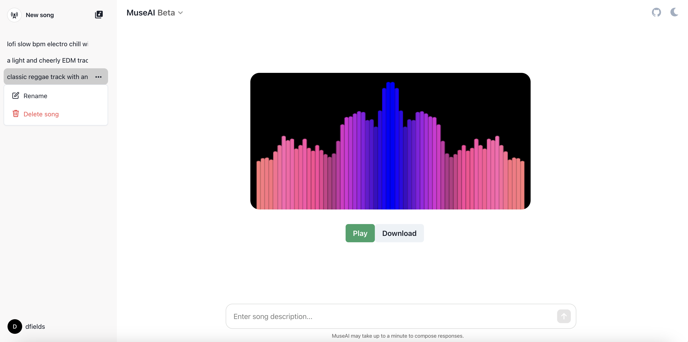

# MuseAI

MuseAI is a web application in the style of ChatGPT where users can generate, listen to, and download AI-generated music. [Visit MuseAI here](http://muse-ai.co) (EDIT: site no longer up as of November 2024, see below for instructions on local deployment).



(Note: Website performance is optimized for Chrome users)

## Key Features

- **Generate Music:** Leverage AI to create unique music pieces.
- **Audio Visualization:** Visual representations of generated music through real-time audio waveforms.
- **Save Creations:** Users can log in to save their music and access it anytime.
- **Download Tracks:** Easy download options for sharing and playback.

## Tech Stack

- **Frontend:** React
- **Backend:** Node.js/Express, WebSocket, PyTorch
- **Database:** PostgreSQL
- **Containerization:** Docker-Compose
- **Deployment:** AWS EC2, Amazon Route 53

## Local Installation

First, make sure you have Docker and Docker-Compose installed on your machine.
Then, to set up MuseAI locally using Docker-Compose, follow these instructions:

1. **Clone the Repository**
   ```bash
   git clone git@github.com:saahas-kohli/MuseAI.git
   cd MuseAI
   git checkout docker-local
2. **Build and Run Docker Containers**
   ```bash
   docker-compose build
   docker-compose up
   ```
   Note: This step might take a while to run.       
   Finally, visit the site on http://localhost:3000/

## Credits

This project was written by Daniel Fields (dfields@uchicago.edu) and Saahas Kohli (skohli2@g.ucla.edu).

Thanks to Meta for their research into single-stage transformer language models, efficient token interleaving patterns,
and ablation methods, as it was instrumental in enabling us to implement conditional music generation.


